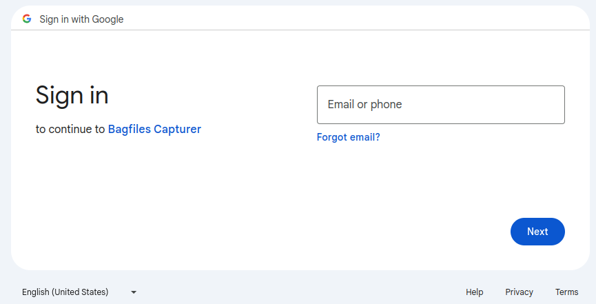

# Google Drive File Uploader

 [](https://www.gnu.org/licenses/gpl-3.0)

**Robotics and Autonomous Systems Group, Research Engineering Facility, Research Infrastructure** 
**Queensland University of Technology**

## Introduction

The google drive file uploader is a ROS 1 (noetic) application node that performs an one-way sync to send files to a Google Drive account. This application node can support the [bagfiles capturer](https://github.com/REF-RAS/bagfiles_capturer). It is designed to operate autonomously and remotely. The one-way sync is a useful feature if file downloading is not required.

The application can operate in web-based mode or headless mode. The web-based mode offers basic monitoring information about the application, such as the files in the upload queue and upload statistics. In the headless mode, the web interface is not available and the application operates in a silent mode.

## Software Requirements and Installation Guide

This application is a package based on ROS 1 (noetic) and Python 3.8 (or above). It uses a number of third party Python modules as specified in `requirements.txt`.

### Step-by-step Installation
1. Create a catkin workspace or use an existing one.
```
mkdir -p ~/catkin_ws/src
cd ~/catkin_ws/src
```
2. Clone this repository under the `src` directory.
```
git clone git@github.com:REF-RAS/gdrive_uploader.git
```
3. Build this package.
```
rosdep install --from-paths src --ignore-src -r -y --rosdistro noetic
source /opt/ros/noetic/setup.bash
catkin_make -DPYTHON_EXECUTABLE=/usr/bin/python3
```
4. Obtain Google Cloud OAuth2 Client ID
The application requires the pair of client_id and client_secret of a Google Cloud web application. 

Follow step 1 to 5 of the [QuickStart](https://pythonhosted.org/PyDrive/quickstart.html) page of PyDrive. Then copy the strings of client_id and client_secret to the file `/config/settings.yaml` under the keys of the same names.
```yaml
client_config_backend: settings
client_config:
  client_id: null
  client_secret: null
...
```
(The Developer: Please email me for the pair if you are a colleague in the REF-RAS team)

5. Connect the uploader application to a Google Drive account

The client_id and the client_secret enable the uploader application to coonect to a Google Drive account. Refer to the following section for the method.

6. Start the uploader application. The application should start even though some of the configuration parameters need changing.
```
cd ~/catkin_ws
source devel/setup.bash
rosrun gdrive_uploader run.py
```
7. Test the application using a web browser.
A web interface is provided if the mode is `web`. Point the web browser to `http://0.0.0.0:8070`, which is the default URL for the web interface. The following web interface should appear.


## Register the Uploader to a Google Drive Account

1. Run the the following command to connect the uploader application to a Google Drive account.
```bash
rosrun gdrive_uploader register_gdrive.py
```

2. The web browser will load a Google login page. Login to the target Google Drive account.

3. The uploader application is not a completely registered Google application. The following warning page will appear. 


4. The warning can be bypassed by clicking o the _Advanced_ link near the bottom. Then a new link named _Go to Bagfiles Capturer (unsafe)_  (or another project name that was used in the OAuth2 ID registration) will appear. Click on the new link to get through the warning page.

5. The next page invites the owner of the Google Drive account to give access to the uploader application. Grant all privilege to the account and click the _Continue_ button. 


6. The access grant to the application is now completed. The program `register_gdrive.py` have saved the credential file under `~/.config/gdrive_uploader` so that the uploader application can reuse the credential file without the need to grant access right again.

## The Configuration yaml File

The configuration file `config/uploader_config.yaml` must be edited so that the application can run properly. The following goes through every parameter.

```yaml
uploader.mode: web   # web or headless
```
Determines whether the bagfile capturer provides a web interface (`web`) or no interface (`headless`). Other values will cause an error.

```yaml
# filestore path
uploader.filestore.local: /home/qcr/Insync/Bagfiles
uploader.filestore.remote: /Bagfiles
```
The `uploader.filestore.local` specifies the local directory where new files are to be detected and uploaded. Note that the uploader is only interested in _new_ files. However, touching the files can force the uploader to consider them as new files.

The `uploader.filestore.remote` specifies the target folder to receive the uploaded file on Google Drive.

```yaml
uploader.web.host: 0.0.0.0
uploader.web.port: 8070
uploader.web.launch_browser: False  # whether to launch the web browser when the application starts
```
Determines the host IP and the port number of the web interface. Changing from `False` to `True` for `uploader.web.launch_browser` tells the application to launch the web browser and point it at the given host IP and port number.

```yaml
uploader.delay: 30 # seconds
uploader.error_count.max: 5  
```
The uploader autonomously detect new or modified files. It waits for a period of time before uploading the file to allow the file writer to finish writing. 

Failures to upload file will be retried up to a maximum error count, as specified in `uploader.error_count.max`. 

## The Commands

The following command will launch the google drive file uploader in the mode specified in the configuration file.
```bash
roslaunch gdrive_uploader upload.launch
```
The mode can be specified in the command as follows, which will override the one in the configuration file. 
```bash
roslaunch gdrive_uploader upload.launch mode:=headless
```
The database can be reset from the command line. Use the following command to drop all database tables and re-create them.
```bash
rosrun gdrive_uploader reset_database.py
```
The google drive uploader is linked to a Google Drive account as the destination of the one-way sync. Run the following command to authorize this application to access the intended Google Drive account. 
```bash
rosrun gdrive_uploader register_gdrive.py
```
The `register_gdrive.py` will bring up a web interface from Google so that the uploader application can be granted access to a Google Drive account.

### Working with Bagfiles Capturer

The [bagfiles capturer](https://github.com/REF-RAS/bagfiles_capturer) provides a launch file that brings up both this uploader and the capturer.

```bash
roslaunch bagfiles_capturer capture_and_upload.launch mode:=headless
```

## Author

Dr Andrew Lui, Senior Research Engineer <br />
Robotics and Autonomous Systems, Research Engineering Facility <br />
Research Infrastructure <br />
Queensland University of Technology <br />

Latest update: May 2024